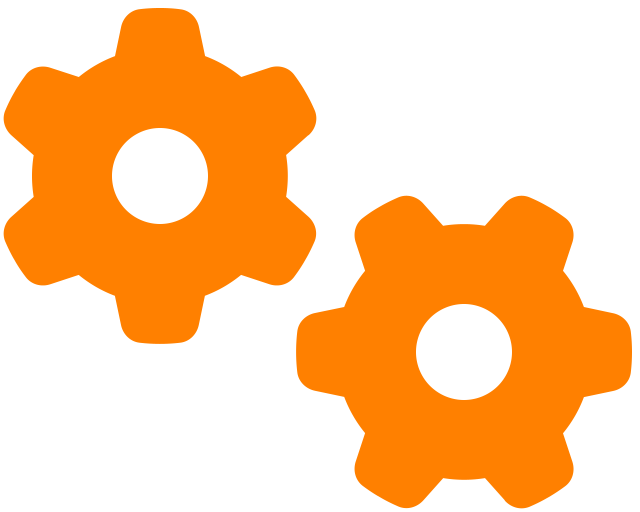

- 👋 Hi, I’m Daniel Ortiz or @koinu1203, either way is correct :wink:

  

# 

<h3 style="font-size:24px"> 

> &nbsp;statistics
</h3>

  &nbsp;&nbsp;&nbsp;&nbsp;&nbsp;&nbsp;

<h3 style="font-size:24px"> 

> &nbsp;Tech Stack

</h3>

 

- &nbsp;
  
  
  
  
  
  
  
  

- &nbsp;&nbsp;
  
  
  
  
  
  
-  &nbsp;&nbsp;
  
  
  
- &nbsp;
  
  
  
  
-  &nbsp;
  
  
  

<h3 style="font-size:24px">

>  &nbsp;Latest Projects: &nbsp;

</h3>

&nbsp;&nbsp;&nbsp;

  

 

&nbsp;&nbsp;&nbsp;

  

 
<h3 style="font-size:24px">

>  &nbsp;Social Network: &nbsp;

</h3>

  &nbsp;
    &nbsp;
    

 

<!-- 
 -->

<!-- <h4>Skills and Tools: </h4>

	 
  
  
	
  
  
	 
	 
	 
	 
	
  
	
  

 

 -->
